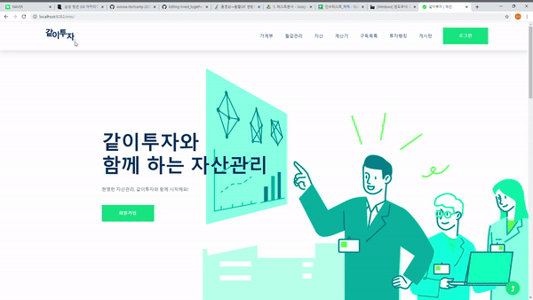

## 같이투자(Invest Together)
김민주, 김태준, 류인혜, 송재권, 양선영의 자산 관리 웹사이트 프로젝트입니다.

Asset management project of Minju Kim, Tae Jun Kim, In Hye Ryu, Jae Kwon Song and Sun Young Yang.
## PREVIEW

## 발표자료
https://drive.google.com/file/d/109lKpXZsKms7LUmtHJPUyxwF70AZOXDi/view?usp=sharing
## 주요 구현 내용

+ 가계부

+ 자산(주식)

## How To Start
