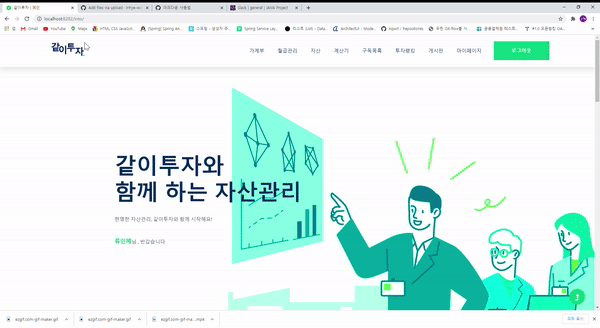
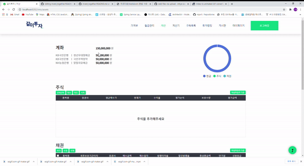
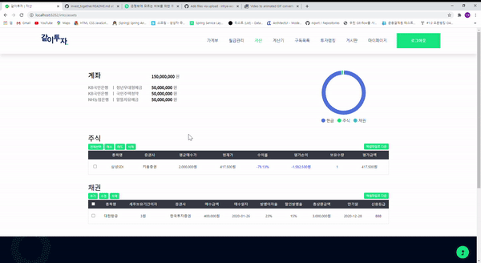
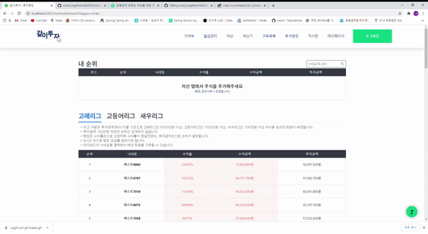
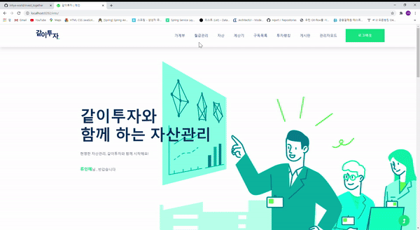

## 같이투자(Invest Together)
김민주, 김태준, 류인혜, 송재권, 양선영의 자산 관리 웹사이트 프로젝트입니다.

Asset management project of Minju Kim, Tae Jun Kim, In Hye Ryu, Jae Kwon Song and Sun Young Yang.

## 발표자료
https://drive.google.com/file/d/109lKpXZsKms7LUmtHJPUyxwF70AZOXDi/view?usp=sharing
## 주요 구현 내용

+ 가계부 : 회원들의 월별 거래 내역과 그래프를 통해 한눈에 소비패턴을 알 수 있다.

  

+ 자산(주식) : 보유 주식의 실시간 현재가 및 평가 손익을 알 수 있다.

  

+ 자산(채권) : 보유 채권 현황을 정리할 수 있다.
  

+ 투자 랭킹 : 투자 규모별 리그로 나눠 각 회원의 투자랭킹을 알 수 있으며, 원하는 회원의 포트폴리오를 구독할 수 있다.

+ 관리자 이지 : 주간 월간 매출 분석과 공지 사항을 기재할 수 있는 페이지

## How To Start
